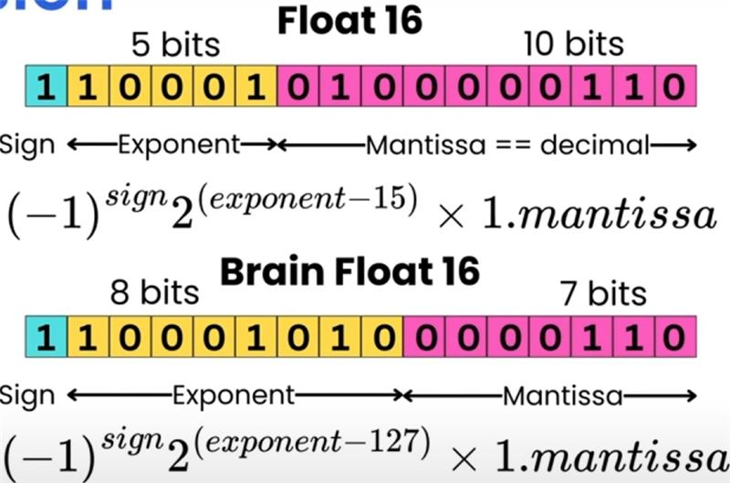
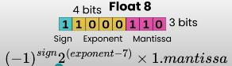

# Image AI Analytics Learnings
_For all documentation of learnings when using PyTorch for Computer Vision and LLM Development_

## Torch
### Torchvision.Tranforms
1. `.RandomVerticalFlips(p)` or `.RandomHorizontallFlips(p)`
    * use real world context and application to decide if vert/hori flipping is natural and/or expected
    * based on context, we can also determine the probability `p`
    * flipping should only be applied to the training data

2. `.Resize((target_y_pixels, target_x_pixels), interpolation)`
    * resize input image to new dimension for de-resolution or standardising size
    * the `interpolation` parameter controls the algorithm used for resampling the image when scaling it to new dimensions. Possible values:
        - BILINEAR: Uses a `2x2` pixel neighborhood for linear interpolation
        - BICUBIC: Uses a `4x4` pixel neighborhood for cubic interpolation
        - NEAREST: Uses the nearest neighbor pixel value **(no interpolation)**
        - NEAREST_EXACT: A more precise version of nearest neighbor interpolation
        - Others like LANCZOS, BOX, and HAMMING are also available
    * High-Level Understanding: Think of interpolation as the method used to "fill in the gaps" when an image is resized. When you're making an image larger or smaller, you need to create new pixel values that didn't exist in the original image.

## Float Accuracy
Floating point accuracy or "Precision" refers to the floating point precision scale used in math operations, subject to environment. This can affect model training loop accuracy, and alter downstream performance. Also, different floating points will use up different levels of VRAM (on GPU cuda). 

Different GPUs can handle different levels of floating point precision. Using an inadequate GPU on a unsuitable precision can lead to OOM Error (OutOfMemory).

## Overview of Floating Point Formats

Floating point numbers are represented by a sign bit, exponent bits, and mantissa (fraction) bits. The precision is primarily determined by the number of mantissa bits, while the range is determined by the exponent bits.

### FP32 (Single Precision)
- **Format**: 1 sign bit, 8 exponent bits, 23 mantissa bits
- **Precision**: Highest precision among the formats you listed
- **Range**: Largest range (approximately ±3.4 × 10³⁸)
- **Use case**: Scientific computing, high-precision calculations

### FP16 (Half Precision)
- **Format**: 1 sign bit, 5 exponent bits, 10 mantissa bits
- **Precision**: Lower precision than FP32 but higher than FP8
- **Range**: Smaller range than FP32 (approximately ±65,504)
- **Use case**: Graphics, machine learning where full precision isn't required

### BF16 (Brain Floating Point)
- **Format**: 1 sign bit, 8 exponent bits, 7 mantissa bits
- **Precision**: Lower precision than FP32 and FP16
- **Range**: Same range as FP32 (due to having the same 8 exponent bits)
- **Use case**: Deep learning training, where dynamic range is more important than precision

### FP8 (8-bit Floating Point)
- **Format**: 1 sign bit, typically 4 exponent bits, 3 mantissa bits
- **Precision**: Lowest precision among all formats mentioned
- **Range**: Smallest range (significantly less than FP16)
- **Use case**: Neural network inference, very low-precision AI applications 

    
     
    <b>Figure:</b> Visual Representation of FP16 & BF16

    
     
    <b>Figure:</b> Visual Representation of FP8

### Comparison

In terms of **precision** (from highest to lowest):
1. FP32 (23 mantissa bits)
2. FP16 (10 mantissa bits)
3. BF16 (7 mantissa bits)
4. FP8 (3 mantissa bits)

In terms of **range** (from largest to smallest):
1. FP32 and BF16 (both have 8 exponent bits)
2. FP16 (5 exponent bits)
3. FP8 (typically 4 exponent bits)

The format with the **most precision** is **FP32**.
The format with the **least range** is **FP8**.

BF16 represents an interesting compromise - it sacrifices precision by reducing mantissa bits but maintains the same range as FP32 by keeping the same number of exponent bits, which makes it particularly useful for deep learning applications where numerical range is more important than fine-grained precision.